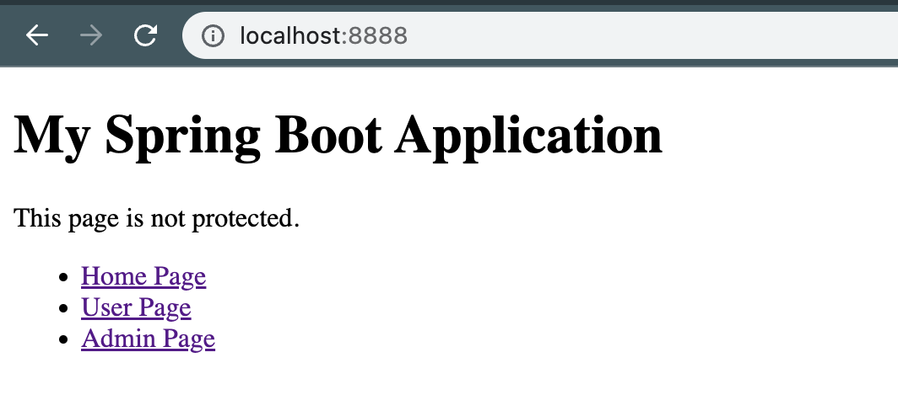
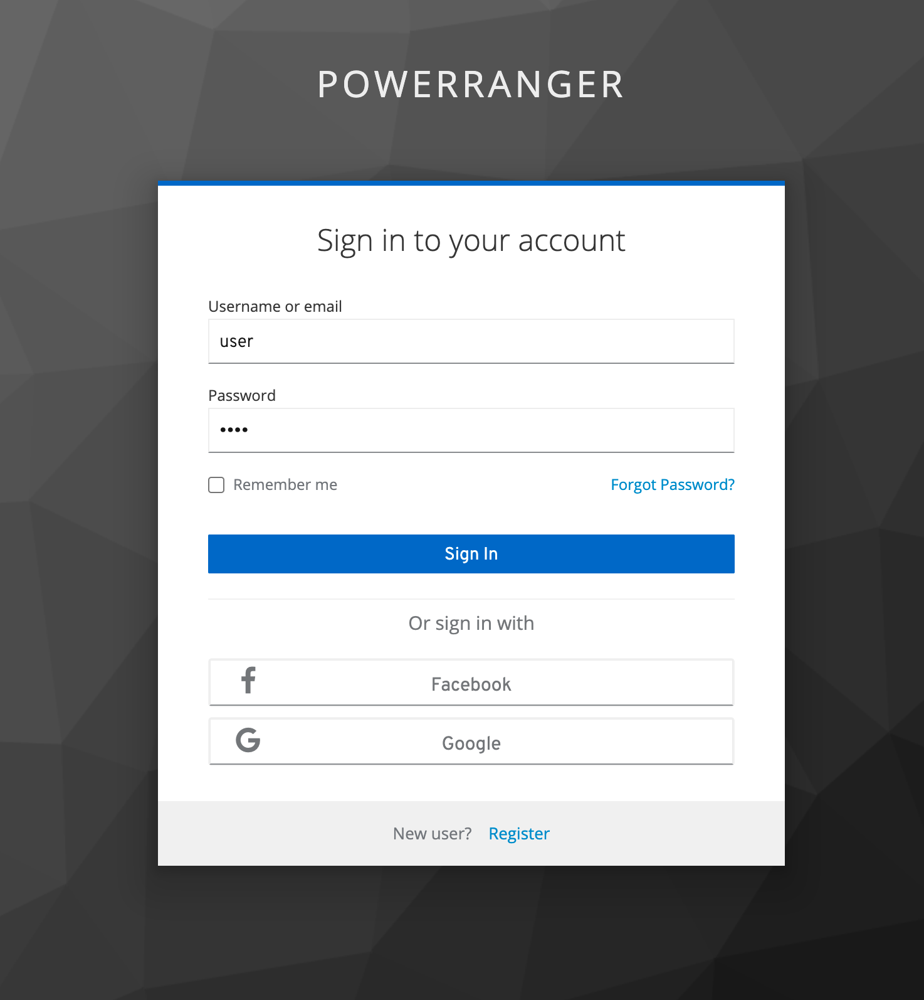
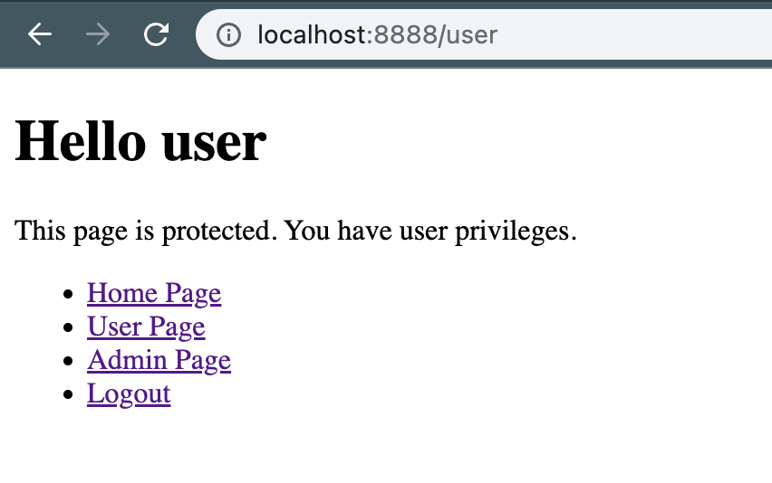
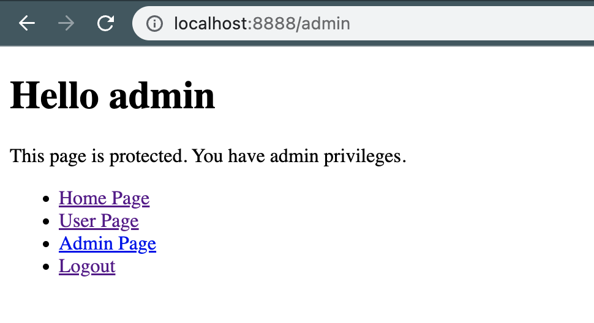

# spring-boot-keycloak-sample

### Things todo list:

1. Clone this repository: `git clone https://github.com/hendisantika/spring-boot-keycloak-sample.git`
2. Navigate to the folder: `cd spring-boot-keycloak-sample`
3. Run Keycloak Container using Docker Compose `docker compose up`
4. Import keycloak realm file
5. Run the application: `mvn clean spring-boot:run`
6. Open your favorite browser: http://localhost:8888

### Image Screen shot

Home Page

Login Page

User Page

Admin Page

